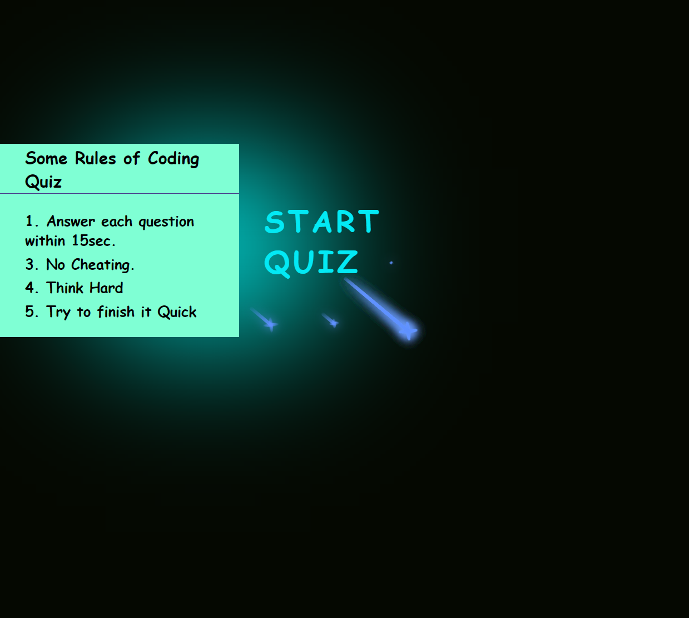

# Quiz
challenge 4
The assignment was to create a Coding Quiz that users can use to test their coding knowledge.
The app is create using components like HTML,JavaScript,CSS, JQuery etc.
When users clicks a start button, user should be able to generate different coding questions and the timer should start at the same time.

